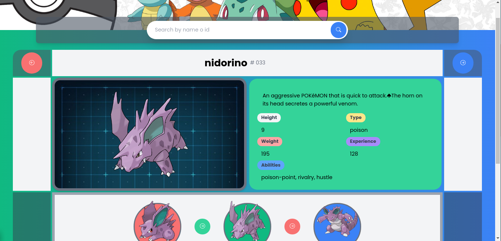

# Trabajo Practico #2

**~ Hacer una interfaz que nos permita ver el nombre e imagen de 3 pokemons y el nombre e imagen de sus evoluciones. Utilizar https://pokeapi.co/.**

**~ Hacer un buscador por nombre de pokemon**

**~ Listar junto al nombre e imagen sus habilidades**

**~ Listar algun otro dato interesante de la API**

